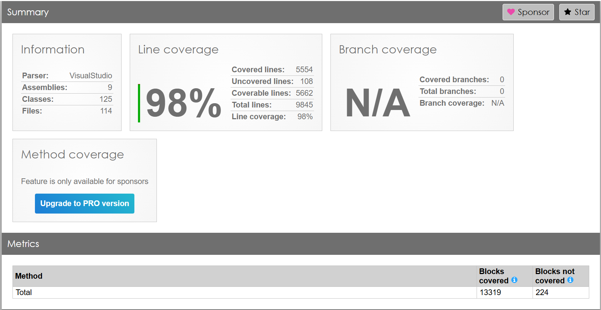

# HongPet E-commerce Testing Documentation

This directory contains the comprehensive test suite for the HongPet E-commerce backend application. The testing approach follows industry best practices to ensure high-quality, robust code that meets business requirements.

## Table of Contents
- [Test Coverage](#test-coverage)
- [Test Structure](#test-structure)
- [Testing Approach](#testing-approach)
- [Technologies Used](#technologies-used)
- [Test Best Practices](#test-best-practices)

## Test Coverage

The test suite maintains 98% code coverage across the backend codebase. This high coverage provides confidence in the reliability of the application and helps prevent regressions during development.

See [Coverage Report](https://vliam0602.github.io/hongpet-ecommerce-test-report/) for more details.

## Test Structure
The test solution is organized following the same clean architecture principles as the main application:

| Directory                          | Information                                                                 |
|------------------------------------|-----------------------------------------------------------------------------
| [HongPet.Domain.Test](./HongPet.Domain.Test/)         | Contains reusable setup tests and unit tests for domain entities, such as mocking users and categories. |
| [HongPet.Infrastructure.Test](./HongPet.Infrastructure.Test/) | Tests for repository implementations, database operations, and external service integrations. |
| [HongPet.Application.Test](./HongPet.Application.Test/)       | Tests for application services and business logic. Includes validation of service behaviors. |
| [HongPet.WebApi.Test](./HongPet.WebApi.Test/)                 | Tests for API endpoints, controllers, and request/response handling. Focuses on integration and functional testing. |

## Testing Approach
The test suite follows these testing principles:

- **Unit Tests:** Verify individual components in isolation with mocked dependencies.
- **Repository Tests:** Ensure data access and persistence work correctly using in-memory databases.
- **Service Tests:** Validate the main logic of the application, including business rules and service behaviors.
- **Controller Tests:** Test API endpoints for correct behavior, including request validation and response formatting.

## Technologies Used
- **xUnit:** Primary testing framework.
- **Moq:** For creating mock objects in unit tests.
- **AutoFixture:** For generating test data and handling recursive object relationships.
- **FluentAssertions:** For more readable and expressive assertions.
- **EF Core InMemory Provider:** For repository testing without a real database.
- **ReportGenerator:** For generating code coverage reports.

## Test Best Practices
- Each test follows the Arrange-Act-Assert pattern.
- Tests are isolated from each other to avoid side effects.
- External dependencies are mocked using tools like Moq.
- Test names are descriptive and clearly indicate the behavior being verified.
- Each test verifies only one behavior to ensure clarity and maintainability.
- Both positive and negative cases are tested to cover edge cases and error scenarios.